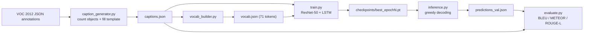

# Image Captioning on Pascal VOC 2012

A CNN–LSTM encoder–decoder that generates natural-language captions for Pascal VOC 2012 images.

Pascal VOC has no human-written captions, only object annotations. This project closes that gap with a **rule-based synthetic caption generator** that turns each image's object labels into a sentence (e.g. *"two people and two aeroplanes in the scene"*), then trains a **ResNet-50 encoder + LSTM decoder** to produce those captions directly from pixels.

---

## Results

Evaluated on the VOC 2012 **validation split** with greedy decoding, using the best checkpoint by validation loss.

| Metric  | Score |
|---------|-------|
| BLEU-1  | 0.547 |
| BLEU-4  | 0.269 |
| METEOR  | 0.554 |
| ROUGE-L | 0.519 |

### Sample predictions (validation set)

| Image ID | Ground truth (synthetic) | Model prediction | Notes |
|---|---|---|---|
| `2007_001289` | one bird in the image | one bird in the image | Exact match |
| `2007_000123` | one train are present in the scene | one train in the scene | Correct content, different template |
| `2007_000033` | the image contains three aeroplanes | the image contains one aeroplane | Right class, wrong count |
| `2007_000464` | the image contains two cows | the image contains one horse and one person | Class confusion |
| `2007_000661` | one pottedplant, one sofa, and one chair are present in the scene | the image contains one \<unk> one \<unk> and one diningtable | `<unk>` slots, see [Known limitations](#known-limitations) |

Full predictions are in [`data/processed/predictions_val.json`](data/processed/predictions_val.json).

---

## Pipeline



### 1. Synthetic caption generation (`src/utils/caption_generator.py`)

For every annotated image:

1. Read the object class labels from the Supervisely-format JSON (`classTitle` of each object), ignoring the `neutral` label and skipping images with no objects.
2. Count each class and build a count phrase: `one` / `two` / `three`, then digits for 4+ (`6 cows`), with simple pluralization (`person → people`, otherwise `+s`).
3. Join the phrases with `and` (two classes) or an Oxford-comma list (three or more).
4. Drop the phrase into one of four templates, chosen at random with a fixed seed (42) for reproducibility:
   - `{phrase} in the scene`
   - `{phrase} in the image`
   - `the image contains {phrase}`
   - `{phrase} are present in the scene`

Example: an image annotated with 2 × `person` and 2 × `aeroplane` becomes *"two people and two aeroplanes in the scene"*.

Captions are saved to `data/processed/captions.json`, keyed as `"<split>/<image_id>"`.

### 2. Vocabulary (`src/utils/vocab_builder.py`)

Captions are tokenized with NLTK and every token is kept (`min_freq=1`), plus four special tokens: `<pad>`=0, `<bos>`=1, `<eos>`=2, `<unk>`=3. The resulting vocabulary has **71 tokens**: the 20 VOC class names, their plurals, count words, and template words.

### 3. Model (`src/models/`)

```
image (3 × 224 × 224, ImageNet-normalized)
        │
        ▼
ResNet-50 backbone, ImageNet weights, frozen        → 2048-d
        │
        ▼
Linear 2048 → 256  +  BatchNorm1d                    → image feature (256-d)
        │
        ▼
Linear 256 → 512  +  tanh                            → LSTM initial hidden state h₀ (c₀ = 0)
        │
        ▼
LSTM (embedding 256, hidden 512, 1 layer)  ← embeddings of <bos>, w₁, …, wₙ
        │
        ▼
Linear 512 → 71                                      → next-token logits
```

- **EncoderCNN** (`encoder.py`): pretrained ResNet-50 with the classification head removed. Only the new projection and BatchNorm layers are trained.
- **DecoderRNN** (`decoder.py`): the image conditions the decoder only through the initial hidden state. At inference, `generate()` runs greedy decoding from `<bos>` for up to 20 tokens, stopping early once every sequence has emitted `<eos>`.

### 4. Training (`train.py`)

- **Teacher forcing**: the decoder gets `caption[:, :-1]` as input and is trained to predict `caption[:, 1:]`.
- **Loss**: cross-entropy, ignoring `<pad>` positions.
- **Optimizer**: Adam, lr `1e-3`, over the decoder plus the encoder's projection and BatchNorm layers.
- **Gradient clipping**: max norm 5.0 on the decoder.
- **Checkpointing**: after each epoch the model is scored on the validation set; whenever validation loss improves it is saved to `checkpoints/best_epoch{N}.pt` (encoder, decoder, epoch, val loss, and vocabulary).

| Hyperparameter | Value |
|---|---|
| Image size | 224 × 224 |
| Embedding size | 256 |
| LSTM hidden size | 512 |
| LSTM layers | 1 |
| Batch size | 32 |
| Epochs | 5 |
| Learning rate | 1e-3 |
| Max decode length | 20 |

### 5. Evaluation (`src/eval/`)

Predictions and references are lowercased, stripped of punctuation, and whitespace-normalized, then scored per image and averaged over all images present in both files:

- **BLEU-1 / BLEU-4**: NLTK `sentence_bleu` with smoothing method 4
- **METEOR**: NLTK `meteor_score`
- **ROUGE-L**: F-score from a longest-common-subsequence implementation in `metrics.py`

Each image has a single reference caption.

---

## Project structure

```
ImageCaptionProject/
├── data/
│   ├── train/ val/ test/ trainval/   # VOC 2012 images + annotations (not committed)
│   │   ├── img/                      #   <image_id>.jpg
│   │   └── ann/                      #   <image_id>.jpg.json (Supervisely format)
│   └── processed/                    # committed artifacts
│       ├── captions.json             #   synthetic captions, keyed "split/image_id"
│       ├── vocab.json                #   word → index mapping
│       └── predictions_val.json      #   model output on the val split
├── src/
│   ├── config.py                     # paths and split names
│   ├── dataloader/
│   │   ├── voc_datasetninja.py       # reads VOC annotations (used for caption generation)
│   │   └── caption_dataset.py        # image + caption dataset and padding collate_fn
│   ├── models/
│   │   ├── encoder.py                # ResNet-50 encoder
│   │   └── decoder.py                # LSTM decoder with greedy generate()
│   ├── utils/
│   │   ├── caption_generator.py      # annotations → synthetic captions
│   │   └── vocab_builder.py          # captions → vocabulary
│   └── eval/
│       ├── metrics.py                # BLEU, METEOR, ROUGE-L
│       └── evaluate.py               # dataset-level scoring
├── train.py                          # training loop
├── inference.py                      # caption generation + evaluation
└── README.md
```

---

## Setup

### 1. Environment

```bash
git clone <your-repo-url>
cd ImageCaptionProject

python -m venv .venv
source .venv/bin/activate        # Windows: .venv\Scripts\activate

pip install torch torchvision pillow nltk tqdm
```

Download the NLTK data used for tokenization and METEOR:

```bash
python -c "import nltk; [nltk.download(p) for p in ['punkt', 'punkt_tab', 'wordnet', 'omw-1.4']]"
```

A GPU is used automatically if available; training also runs on CPU, just more slowly.

### 2. Data

This project uses the **Pascal VOC 2012 (segmentation subset) in DatasetNinja / Supervisely JSON format**. It can be downloaded from the [DatasetNinja repository](https://github.com/dataset-ninja/pascal-voc-2012), or with their Python package:

```bash
pip install --upgrade dataset-tools
```

```python
import dataset_tools as dtools
dtools.download(dataset="PASCAL VOC 2012", dst_dir="~/dataset-ninja/")
```

Then move or symlink the split folders into `data/` so that each split has `img/` and `ann/` subfolders:

```
data/train/img/2007_000032.jpg
data/train/ann/2007_000032.jpg.json
data/val/img/...
data/val/ann/...
```

Raw data and checkpoints are excluded by `.gitignore`; only `data/processed/` is committed.

---

## Usage

Run all commands from the repository root.

```bash
# 1. Generate synthetic captions  → data/processed/captions.json
python -m src.utils.caption_generator

# 2. Build the vocabulary         → data/processed/vocab.json
python -m src.utils.vocab_builder

# 3. Train                        → checkpoints/best_epoch{N}.pt
python train.py

# 4. Caption the val split and score it
#    (set checkpoint_path in inference.py's main() to your best checkpoint first)
python inference.py

# Re-score existing predictions without re-running the model
python -m src.eval.evaluate
```

Steps 1 and 2 are optional if you keep the committed files in `data/processed/`. Because template selection is seeded and files are processed in sorted order, regenerating captions reproduces the same output.

---

## Known limitations

- **Tokenizer mismatch produces `<unk>` tokens.** `vocab_builder.py` tokenizes with NLTK's `word_tokenize`, which splits commas into separate tokens, while `CaptionDataset` splits on whitespace only. In any caption listing three or more object types, words followed by a comma (`"pottedplant,"`, `"sofa,"`) are not in the vocabulary and become `<unk>` during training, so the model learns to emit `<unk>` in those positions. Using the same tokenizer in both places and retraining should fix this and likely raise all four metrics.
- **Caption grammar quirks.** Pluralization just appends "s" (`buss`, `sheeps`), and the `are present in the scene` template is also applied to single objects (`one cat are present in the scene`). These errors are baked into the training targets, so the model reproduces them.
- **Single random-template reference.** Each image has one reference caption with a randomly chosen template, so a prediction naming exactly the right objects with a different template (`in the image` vs. `in the scene`) is still penalized. The metrics therefore understate how well the model recognizes objects.
- **"Frozen" backbone still updates BatchNorm statistics.** `encoder.train()` puts ResNet-50's BatchNorm layers in training mode, so their running mean and variance drift during training even though the weights are frozen. Calling `encoder.cnn.eval()` after `encoder.train()` would keep it a true fixed feature extractor.
- **Hard-coded configuration.** Hyperparameters, epochs, and the inference checkpoint path (`checkpoints/best_epoch4.pt`) are set directly in the scripts rather than via CLI arguments or a config file.

## Future work

- Fix the tokenizer mismatch and caption grammar, then retrain.
- Beam search instead of greedy decoding.
- Attention over ResNet spatial features (Show, Attend and Tell) instead of a single pooled vector.
- Richer synthetic captions using bounding-box geometry for spatial relations (e.g. "a person next to a horse").
- Fine-tune the upper ResNet blocks.
- Train and evaluate on human-written captions (MS COCO, Flickr30k) for comparison.

---

## Acknowledgments

- Developed for **CS 673: Computer Vision** at the University of Alabama at Birmingham.
- **Pascal VOC 2012**: M. Everingham, L. Van Gool, C. K. I. Williams, J. Winn, A. Zisserman. *The PASCAL Visual Object Classes (VOC) Challenge.* International Journal of Computer Vision, 88(2), 303–338, 2010.
- Dataset packaging in Supervisely JSON format by [DatasetNinja](https://github.com/dataset-ninja/pascal-voc-2012).
- ResNet-50 ImageNet weights from `torchvision`.
